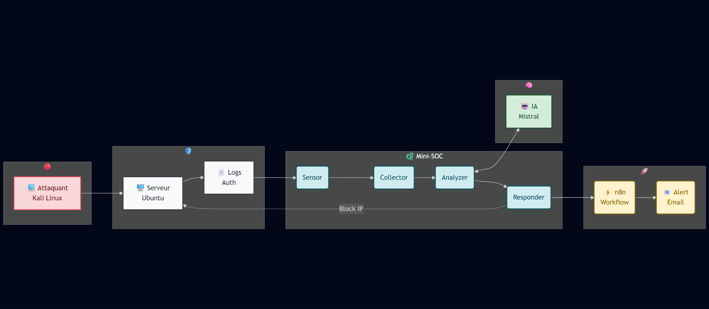
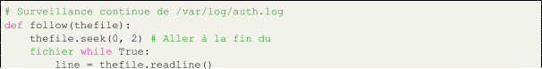
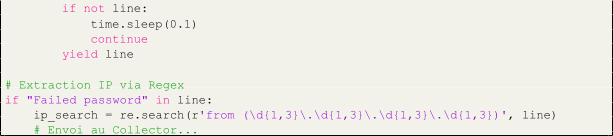
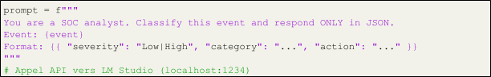
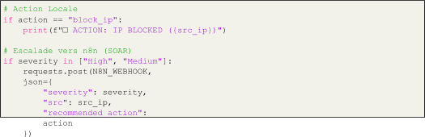
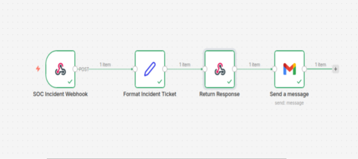

> Rapport de Travaux Pratiques
>
> Implémentation d’un Mini-SOC Automatisé Assisté par Intelligence
> Artificielle et SOAR
>
> Réalisé par :
>
> Khabali Ayoub
>
> El Maimouni Motaoukel Znita Mohamed Andrew Kiswaga John
>
> 20 décembre 2025
>
> Résumé
>
> Ce rapport détaille la mise en œuvre d’un *Security* *Operations*
> *Center* (SOC) minia-ture basé sur une architecture d’agents
> autonomes. Le projet intègre une détection d’intrusions réelle
> (surveillance de logs SSH), une analyse contextuelle via un LLM lo-
> cal (Mistral 7B) et une orchestration automatisée (SOAR) via n8n pour
> la notification d’incidents.

Table des matières

1 Architecture Globale 2

2 Codes et Logique des Agents 2 2.1 L’Agent
Sensor..........................................................................................................................2
2.2 L’Agent
Analyzer.......................................................................................................................3
2.3 L’Agent
Responder...................................................................................................................3

3 Automatisation et Orchestration (n8n) 3 4 Chronologie d’un Incident
(Use Case) 4 5 Analyse du Comportement de l’IA 5 6 Propositions
d’Amélioration 5

> 1 Architecture Globale
>
> L’architecture déployée repose sur la coopération de quatre agents
> logiciels développés en Python, interagissant avec une infrastructure
> réelle (Ubuntu/Kali) et des outils externes (LM Studio, n8n).
>
> Figure 1: Schéma de l’architecture complété (Flux de données de gauche
> à droite) Le système est divisé en trois zones critiques :
>
> • Zone Menace : Une VM Kali Linux générant des attaques réelles (Brute
> Force SSH).
>
> • Zone Détection : Un serveur Ubuntu hébergeant le service SSH ciblé
> et les agents Python.
>
> • Zone Intelligence & Réponse : L’IA locale (Mistral 7B) pour
> l’analyse cognitive et n8n pour l’orchestration (Ticketing/Email).
>
> 2 Codes et Logique des Agents
>
> Les agents ont été développés pour répondre à des besoins spécifiques
> de production, dépassant la simple simulation.
>
> 2.1 L’Agent Sensor (L’Œil)
>
> Le Sensor a été amélioré pour surveiller les logs réels du système en
> temps réel, nécessi- tant des privilèges root.

1

2

3

4

5

>  style="width:6.39583in;height:1.41667in" />6
>
> 7
>
> 8
>
> 9

10

11

12

13

14

> Listing 1: Logique de lecture temps réel du Sensor
>
> 2.2 L’Agent Analyzer (Le Cerveau)
>
> L’Analyzer formate les données brutes en un ”Prompt” optimisé pour
> garantir une réponse JSON stricte de la part du LLM.
>
>  style="width:6.39583in;height:1.01042in" />1
>
> 2
>
> 3
>
> 4
>
> 5
>
> 6
>
> Listing 2: Interaction avec Mistral 7B
>
> 2.3 L’Agent Responder (Le Bras Armé)
>
> Le Responder intègre une logique hybride : action locale immédiate et
> délégation SOAR pour les cas graves.
>
>  style="width:6.39583in;height:1.77083in" />1
>
> 2
>
> 3
>
> 4
>
> 5
>
> 6
>
> 7
>
> 8
>
> 9

10

11

> Listing 3: Intégration SOAR (n8n)
>
> 3 Automatisation et Orchestration (n8n)
>
> Pour compléter la réponse technique locale, une couche SOAR
> (*Security* *Orchestration,* *Au-tomation* *and* *Response*) a été
> implémentée via l’outil n8n. Cette couche assure la traçabilité
> administrative des incidents critiques.

> Figure 2: Workflow n8n : Réception Webhook *→* Formatage Ticket *→*
> Envoi Email Le workflow fonctionne selon la logique suivante :
>
> 1\. Webhook (Trigger) : Réceptionne les données JSON envoyées par
> l’agent *Responder* (uniquement pour les sévérités High/Medium).
>
> 2\. Format Incident Ticket : Transforme l’objet JSON technique en un
> rapport lisible pour un humain (Texte formaté avec IP, Sévérité,
> Action).
>
> 3\. Notification (SMTP/Gmail) : Envoie instantanément une alerte par
> email à l’ana-lyste de sécurité, garantissant une supervision humaine
> rapide même en dehors des heures de bureau.

4 Chronologie d’un Incident (Use Case)

Nous avons simulé et traité une attaque par force brute SSH. Voici le
déroulement exact, confirmé par les logs d’exécution.

> 1\. \[T+0s\] L’Attaque : Depuis Kali Linux, exécution de la commande :
> ssh [admin@192.168.50.191 (](mailto:admin@192.168.50.191)Mot de passe
> incorrect).
>
> 2\. \[T+0.1s\] Trace Système : Le service SSH d’Ubuntu inscrit l’échec
> dans /var/log/auth.log
>
> :
>
> *”Failed* *password* *for* *invalid* *user* *admin...”*.
>
> 3\. \[T+0.5s\] Détection : Le sensor.py capture cette ligne, extrait
> l’IP de l’attaquant et transmet l’alerte au Collector.
>
> 4\. \[T+2s\] Analyse IA : L’Analyzer interroge Mistral 7B. L’IA
> contextuelle classifie l’événe- ment :
>
> • Sévérité : High
>
> • Catégorie : Brute Force

> • Recommandation : Block IP
>
> 5\. \[T+5s\] Réponse Technique : Le Responder reçoit l’ordre et simule
> le blocage immé- diat (Affichage Console).
>
> 6\. \[T+5.5s\] Orchestration SOAR : Détectant une sévérité critique,
> le Responder dé-clenche le webhook n8n.
>
> 7\. \[T+6s\] Notification : Le workflow n8n formate un ticket
> d’incident et envoie une alerte par Email à l’analyste.

5 Analyse du Comportement de l’IA

L’utilisation d’un LLM local (Mistral 7B Instruct) présente plusieurs
caractéristiques no-tables :

> • Pertinence Sémantique : L’IA distingue efficacement une erreur
> humaine isolée (souvent classée ”Low”) d’un comportement agressif
> (”High”). Elle comprend le contexte ”Failed password” sans règles
> rigides (Regex complexes).
>
> • Contrainte de Structure : La principale difficulté réside dans le
> formatage de la sor- tie. L’IA a tendance à ”bavarder”. L’utilisation
> d’un *System* *Prompt* strict demandant du JSON pur est indispensable
> pour l’automatisation.
>
> • Latence : L’inférence sur CPU prend quelques secondes. Pour un SOC
> temps réel, l’utilisation d’un GPU ou d’un modèle quantifié (4-bit)
> est recommandée.

6 Propositions d’Amélioration

Pour transformer ce prototype en outil de production, les évolutions
suivantes sont pro- posées :

> 1\. Passage à l’Action Réelle (Firewalling) : Remplacer les
> simulations print() par des appels système réels vers iptables ou ufw
> pour bannir physiquement les IPs attaquantes.
>
> 2\. Persistance des Données : Implémenter une base de données (type
> Elasticsearch ou SQLite) au niveau du Collector pour conserver un
> historique légal des incidents, au lieu de tout traiter en mémoire
> volatile.
>
> 3\. Sécurisation des Flux : Chiffrer les communications entre agents
> (HTTPS/TLS) et mettre en place une authentification par jetons (API
> Key) pour éviter qu’un attaquant ne puisse injecter de faux logs dans
> le SOC.
>
> 4\. Gestion des Faux Positifs : Intégrer une liste blanche (Whitelist)
> dans le Responder pour empêcher le blocage accidentel des IPs
> administratives, même si l’IA recom- mande le blocage.
